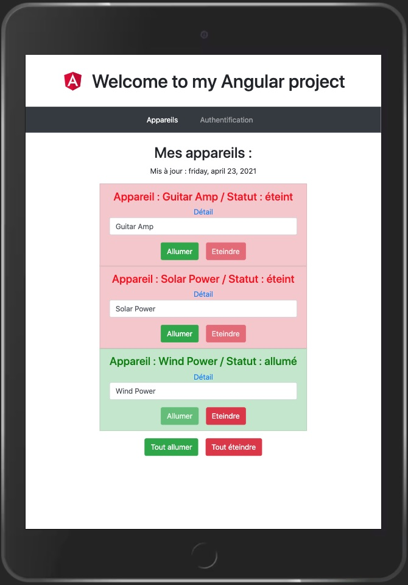

<h1 align="center">Welcome to MyAngularProject 👋</h1>

  
  
  
  

> just a Web Dev student exercice

### 🚀 [My Live Page](https://ipopop.github.io/OC-Angular-App/)

This project was generated with [Angular CLI](https://github.com/angular/angular-cli) version 10.1.6.

## Development server

Run `ng serve` for a dev server. Navigate to `http://localhost:4200/`. The app will automatically reload if you change any of the source files.

## Code scaffolding

Run `ng generate component component-name` to generate a new component. You can also use `ng generate directive|pipe|service|class|guard|interface|enum|module`.

## Build

Run `ng build` to build the project. The build artifacts will be stored in the `docs/` directory. Use the `--prod` flag for a production build.
ng build --prod --baseHref="https://< username >.github.io/< dirname >/"

## Running unit tests

Run `ng test` to execute the unit tests via [Karma](https://karma-runner.github.io).

## Running end-to-end tests

Run `ng e2e` to execute the end-to-end tests via [Protractor](http://www.protractortest.org/).

## Further help

To get more help on the Angular CLI use `ng help` or go check out the [Angular CLI README](https://github.com/angular/angular-cli/blob/master/README.md).

---
## Authors

👤 **eb-dev**
* Website: maboite.space
* Github: [@ipopop](https://github.com/ipopop)

👤 Website tuto : [OpenClassrooms](https://openclassrooms.com/fr)

## Show your support

Give a ⭐️ if this project helped you!

## 📝 License

Copyright © 2021 [eb-dev](https://github.com/ipopop). 
This project is [MIT](https://en.wikipedia.org/wiki/MIT_License) licensed.

***
_This README was generated with ❤️ by [readme-md-generator](https://github.com/kefranabg/readme-md-generator)_
